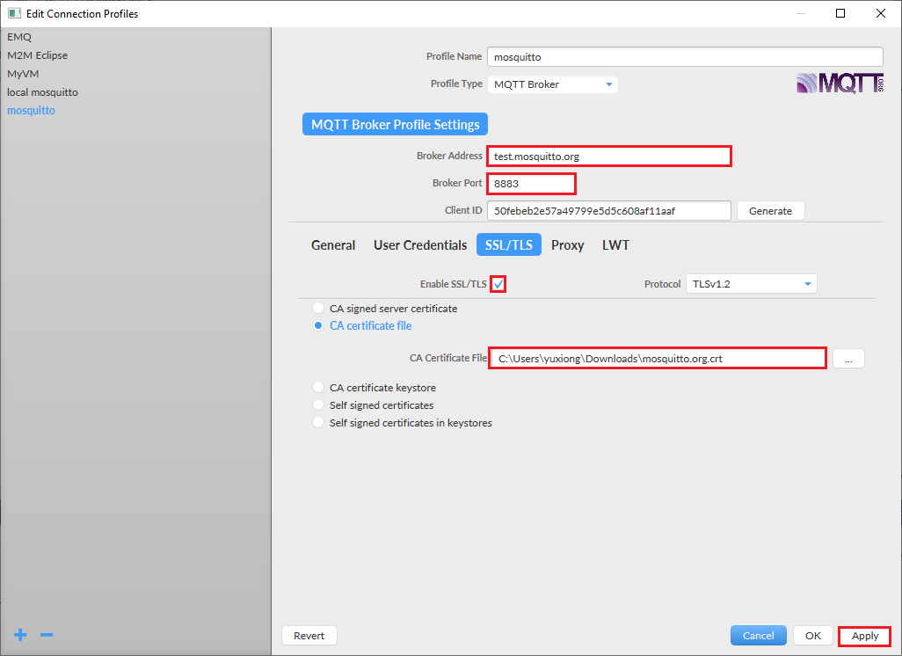

# azure-sphere-mqtts
This sample project shows how to port a 3rd party mqtt library [MQTT-C](https://github.com/LiamBindle/MQTT-C) on Azure Sphere and use wolfSSL api to secure the connection. The MQTT-C is a lightweight MQTT library written by portable C. By adding wolfSSL support in mqtt_pal.c portable layer, we can easily run it on sphere platform. 

The primary test server used in this sample project is test.mosquitto.org, a public available MQTT broker support both server and client authentication on port 8884. 

This sample also support use Azure Sphere DAA certificate to authenticate with a 3rd party MQTT borker. But customer need make sure their server trust sphere tenant CA and can approve device connection by looking at this common name field.

## To build and run the sample

### Prep your device and environment

1. Ensure that your Azure Sphere MT3620 is connected to your PC, and your PC is connected to the internet.

2. Login Azure Sphere Security Service using your microsoft account registered before and select proper tenant for your device, or claim the device into a tenant for the first time using the device. Check this [page](https://docs.microsoft.com/en-us/azure-sphere/install/claim-device) for details.
   
3. Right-click the Azure Sphere Developer Command Prompt shortcut and issue the following command to ensure your device can be debugged. 

   ```
   azsphere dev edv
   ```

### Setup MQTT.fx client for testing

Download the latest [MQTT.fx](https://mqttfx.jensd.de/index.php/download) tool. Open and start a new configuration by clicking the gear icon. Follow below diagram to setup a configuration. 

   - Broker Address: test.mosquitto.org
   - Broker Port: 8883
   - Enable SSL/TLS: checked
   - CA certificate file: download and select [mosquitto.org.crt](https://test.mosquitto.org/ssl/mosquitto.org.crt)



Start a new connection session by clicking 'connect' button. You will see green light on the right side to show a successful connection. Subscribe topic `azsphere/deviceid/time` to be prepared to receive time message sent by device.

### Generate client certificate and private key

Follow the instructions in this [page](https://test.mosquitto.org/ssl/) to create your own private key file and download its client certificate from the web page. Make sure the name of the two files are `client.key` and `client.crt`, then copy to *certs* folder. 

### Build and run Firmware

1. Clone this project using `git clone https://github.com/xiongyu0523/azure-sphere-mqtts`
2. Start Visual Studio 2019.
3. From the **File** menu, select **Open > CMake...** and navigate to the folder that contains the sample to load
4. In Solution Explorer, right-click the CMakeLists.txt file, and select **Generate Cache for azure-sphere-mqtts**. This step performs the cmake build process to generate the native ninja build files. 
5. In Solution Explorer, right-click the *CMakeLists.txt* file, and select **Build** to build the project and generate .imagepackage target.
6. Double click *CMakeLists.txt* file and press F5 to start the application with debugging. 
7. You will start to see Azure Sphere is publishing current time to `azsphere/deviceid/time` topic and received by your MQTT.fx client. You can also try to publish a message to topic `azsphere/deviceid/command` topic in MQTT.fx and see if it arrives on device by checking its debug output in Visual Studio 2019.

### Note

1. test.mosquitto.org is not stable and sometime you may see connection is failed. You can try broker.emqx.io instead. Only mosquitto server support client authentication. 